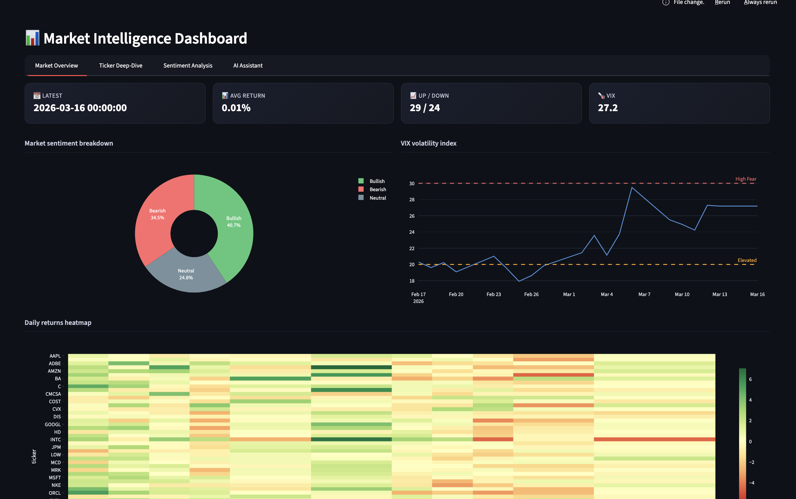
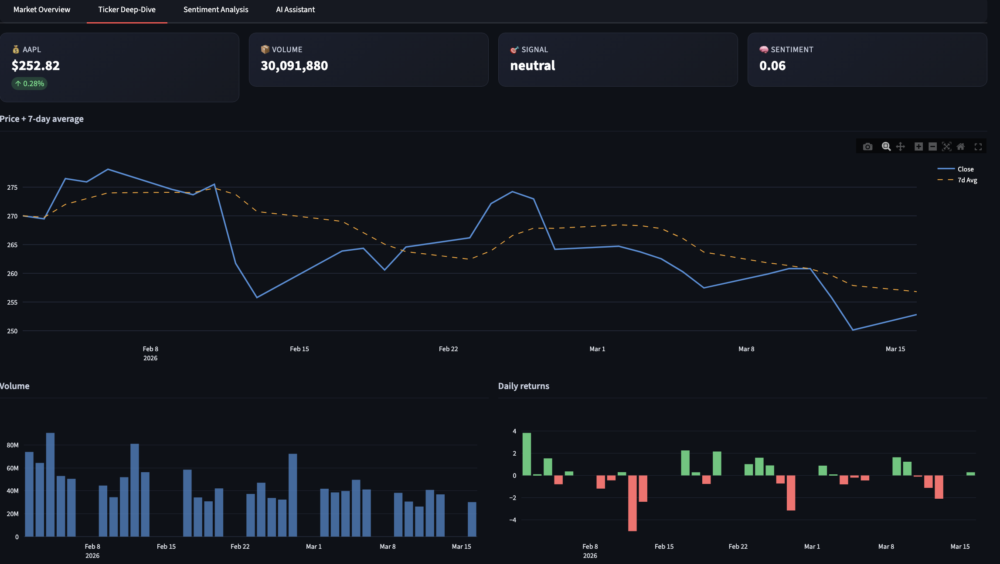
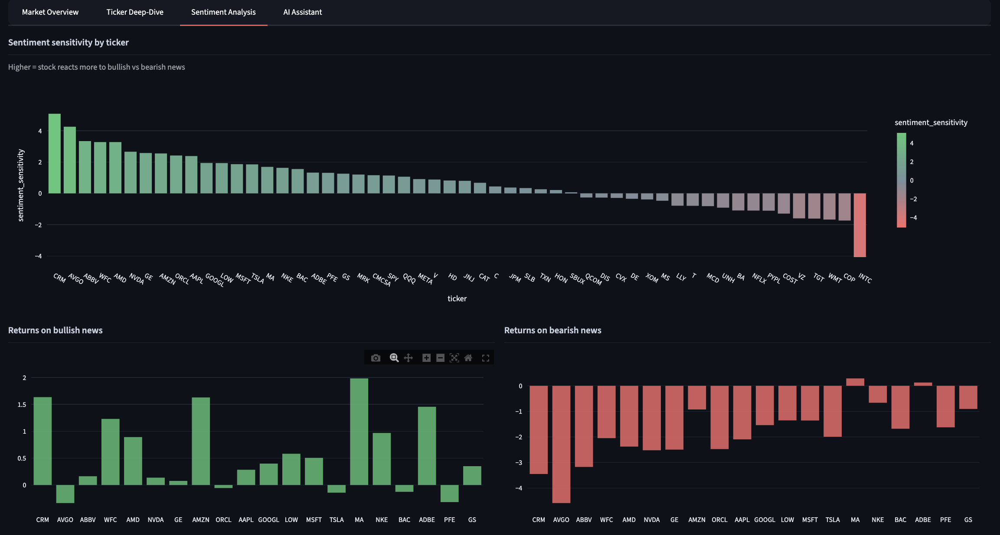
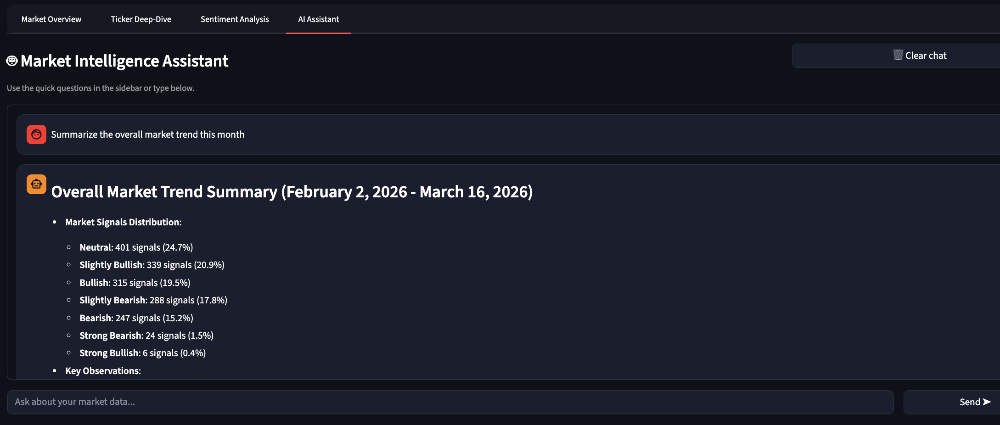

# 📊 Market Intelligence Pipeline

An end-to-end data engineering platform that ingests financial data from multiple sources, enriches it with NLP-powered sentiment analysis, and serves actionable market insights through an AI-powered dashboard.





---

## What This Project Does

This pipeline pulls stock prices, financial news, and macroeconomic indicators daily, transforms them through a medallion architecture (Bronze → Silver → Gold), applies FinBERT sentiment analysis to news headlines, and serves the results through an interactive dashboard with an Azure OpenAI chatbot that can answer natural language questions about the data.

**Key insight it produces:** For each trading day, the system identifies whether news sentiment was bullish or bearish, measures how each stock reacted, and flags divergence events where price movement contradicted the market mood a signal that professional traders watch closely.

---

## Architecture

```
┌──────────────────────────────────────────────────────────────────┐
│  DATA SOURCES                                                    │
│  Yahoo Finance (stocks) · GNews API (news) · FRED API (macro)    │
└──────────────┬───────────────────────────────────────────────────┘
               ▼
┌──────────────────────────────────────────────────────────────────┐
│  BRONZE — Azure Data Lake Gen2                                   │
│  Raw JSON · Immutable · Partitioned by source                    │
└──────────────┬───────────────────────────────────────────────────┘
               ▼
┌──────────────────────────────────────────────────────────────────┐
│  SILVER — PySpark + FinBERT                                      │
│  Type casting · Dedup · Schema enforcement                       │
│  FinBERT sentiment scoring on news headlines (-1 to +1)          │
│  FRED forward-fill for missing macro data                        │
└──────────────┬───────────────────────────────────────────────────┘
               ▼
┌──────────────────────────────────────────────────────────────────┐
│  GOLD — PySpark                                                  │
│  Multi-source join on date (stocks + sentiment + macro)          │
│  Feature engineering: rolling averages, volume spikes, gaps      │
│  Sentiment sensitivity: how each ticker reacts to news           │
└──────────────┬───────────────────────────────────────────────────┘
               ▼
┌──────────────────────────────────────────────────────────────────┐
│  SEMANTIC — dbt + DuckDB                                         │
│  Business logic: market signal classification                    │
│  Bullish/bearish/neutral labeling · Divergence detection         │
│  Data quality tests: not_null, unique, accepted_values           │
└──────────────┬───────────────────────────────────────────────────┘
               ▼
┌──────────────────────────────────────────────────────────────────┐
│  SERVING — Streamlit + Azure OpenAI                              │
│  Interactive dashboard with 4 views                              │
│  AI chatbot for natural language queries on market data          │
└──────────────────────────────────────────────────────────────────┘
               
┌──────────────────────────────────────────────────────────────────┐
│  ORCHESTRATION                                                   │
│  Apache Airflow (daily DAG) · Docker · GitHub Actions CI/CD      │
└──────────────────────────────────────────────────────────────────┘
```

---

## Tech Stack

| Layer | Tools |
|-------|-------|
| Extraction | Python, yfinance, GNews API, FRED API |
| Storage | Azure Data Lake Gen2 (Medallion Architecture) |
| Transformation | PySpark, Apache Spark |
| NLP | HuggingFace Transformers, FinBERT |
| Database | DuckDB, Parquet |
| Semantic | dbt (data build tool) |
| Dashboard | Streamlit, Plotly |
| AI Assistant | Azure OpenAI (GPT-4o-mini) |
| Orchestration | Apache Airflow |
| Containerization | Docker, Docker Compose |
| CI/CD | GitHub Actions |

---

## Project Structure

```
market_intelligence_pipeline/
├── .github/workflows/ci.yml    # CI/CD pipeline
├── dags/                        # Airflow DAG
│   └── market_intelligence_dag.py
├── ingestion/                   # Data extraction scripts
│   ├── extract_stocks.py
│   ├── extract_news.py
│   └── extract_fred.py
├── spark/                       # PySpark transformations
│   ├── bronze_to_silver.py      # Clean + FinBERT sentiment
│   ├── silver_to_gold.py        # Join + feature engineering
│   └── load_to_duckdb.py        # Load Parquet into DuckDB
├── azure/                       # Cloud upload scripts
│   ├── setup_azure_storage.sh
│   └── upload_to_lake.py
├── dbt/                         # Semantic layer
│   ├── models/
│   │   ├── staging/stg_daily_market.sql
│   │   └── marts/
│   │       ├── fct_market_signals.sql
│   │       └── fct_weekly_summary.sql
│   └── dbt_project.yml
├── app.py                       # Streamlit dashboard + AI chatbot
├── run_pipeline.py              # Manual pipeline runner
├── docker-compose.yml           # Multi-service orchestration
├── Dockerfile                   # Airflow image
├── Dockerfile.dashboard         # Streamlit image
└── requirements.txt
```

---

## Key Features

**Sentiment-Driven Market Signals** — Each trading day is classified as bullish, bearish, or neutral based on price movement combined with FinBERT sentiment analysis on financial news headlines. The sentiment ratio ranges from -1 (all negative news) to +1 (all positive).

**Sentiment Sensitivity Analysis** — The pipeline calculates how differently each ticker reacts to market-wide sentiment. CRM showed a sensitivity of +5.09 (swings dramatically with news) while MSFT showed +1.86 (relatively stable).

**Divergence Detection** — When news sentiment is positive but a stock drops (or vice versa), the system flags it as a divergence event — a signal professional traders monitor closely.

**AI Market Assistant** — An Azure OpenAI chatbot with full data context answers natural language questions like "Which stocks dropped the most on positive news days?" or "Give me a market briefing."

---

## Run Locally

### Prerequisites

- Python 3.11+
- Docker Desktop
- Azure account (free tier)
- API keys: GNews (gnews.io), FRED (fred.stlouisfed.org)

### Setup

```bash
git clone https://github.com/yourusername/market-intelligence-pipeline.git
cd market-intelligence-pipeline

python -m venv .venv
source .venv/bin/activate
pip install -r requirements.txt

cp .env.example .env
# Add your API keys to .env
```

### Run the Pipeline

```bash
# Full pipeline
python run_pipeline.py

# Or start from a specific step
python run_pipeline.py --from silver
python run_pipeline.py --from gold
python run_pipeline.py --from dbt
```

### Run with Docker

```bash
docker compose up airflow-init     # First time only
docker compose up -d               # Start all services

# Airflow UI:  localhost:8080  (admin / admin)
# Dashboard:   localhost:8501

docker compose down                # Stop everything
```

### Dashboard Only

```bash
streamlit run app.py
```

### dbt Models

```bash
cd dbt
dbt deps && dbt run && dbt test
```

---

## Data Flow

A single day through the pipeline:

1. **Extract** — Pull AAPL at $252.82, 51 news articles, fed funds rate at 3.64%
2. **Bronze** — Raw JSON lands in Azure Data Lake, untouched
3. **Silver** — Clean types, deduplicate, FinBERT scores each headline → 15 positive, 12 negative, 24 neutral
4. **Gold** — Join by date: AAPL + sentiment ratio +0.06 + VIX 27.2, add rolling averages and volume spikes
5. **dbt** — Classify as "slightly bullish" signal, flag "elevated anxiety" VIX
6. **Dashboard** — Charts + AI chatbot: "AAPL recovered +0.28% on a marginally positive news day"

---

## Lessons Learned

**Free API limitations are real.** GNews returned ~4 days of historical data on the free tier. The pipeline handles this with NULL defaults and a `has_sentiment_data` flag. In production, a paid news feed would provide full coverage.

**FinBERT confidence ≠ sentiment direction.** Raw FinBERT outputs confidence (0 to 1) regardless of positive/negative label. Averaging cancels out. Solution: sentiment ratio = (positive - negative) / total articles, which provides meaningful daily variation.

**Azure free tier has hard limits.** Databricks blocked storage key config on serverless compute. Azure trial blocked VM quota increases. Developed locally with PySpark (identical code) designed for cloud portability.

**Infrastructure is half the job.** More time went to API rate limits, Java paths, Docker credentials, and YAML than data logic. 

---

## Future Improvements

- Paid news APIs for full 30-day sentiment coverage
- Azure Data Factory pipeline alongside Airflow
- Databricks notebooks when quotas allow
- Power BI dashboard for Microsoft-stack alignment
- Terraform for infrastructure as code

---

**Built by Muhammad Hamza** — End-to-end data engineering with NLP integration.
